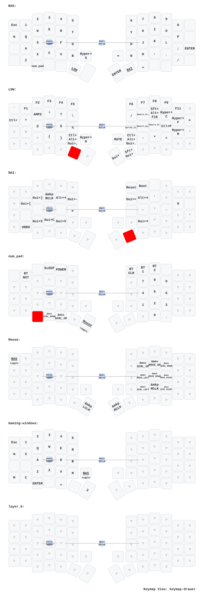

# Sofle v2 ZMK Config

ZMK firmware configuration for a single wireless Sofle v2 split keyboard, running on a pair of `nice_nano_v2` (nRF52840 ProMicro-form) controllers.

Forked from [mctechnology17/zmk-config](https://github.com/mctechnology17/zmk-config) and trimmed to one hardware target.

## Hardware

- One [Sofle v2](https://github.com/josefadamcik/SofleKeyboard) split keyboard.
- Two `nice_nano_v2` clones ("SuperMini" — generic nRF52840 ProMicro footprint).
- Left half: split **central**. Right half: split **peripheral**.
- No OLED display, no RGB underglow — intentionally omitted to maximize battery life.
- Battery sensed via the nRF **VDDH** internal driver (clones leave the P0.24 voltage divider unpopulated, so the stock divider driver reads a floating pin).

## Build

`build.yaml` produces three artifacts via the GitHub Actions **Build** workflow:

| Artifact            | Purpose                                                                |
|---------------------|------------------------------------------------------------------------|
| `sofle_left.uf2`    | Left half (central). ZMK Studio enabled via `studio-rpc-usb-uart`.     |
| `sofle_right.uf2`   | Right half (peripheral).                                               |
| `settings_reset.uf2`| Clears stored BLE bonding. Flash to both halves before re-pairing.     |

Push to `main` (or dispatch the workflow manually) and download artifacts from the workflow run.

## First-time pair / re-pair

1. Put the **left** half into bootloader mode (double-tap reset).
2. Drag `settings_reset.uf2` onto the USB drive. As soon as it reboots, **immediately** put the half back into bootloader.
3. Repeat steps 1–2 for the **right** half.
4. Flash `sofle_left.uf2` to the left, `sofle_right.uf2` to the right.
5. Reset **both halves simultaneously** — they pair automatically.

## Normal flash

Double-tap reset on a half → drag the matching `.uf2` onto the USB drive.

## Soft Off (storage mode)

Hold the top-left key (ESC position) while the `num_pad` layer is active (`&mo 3`, left thumb) for **1.5 s**. Each half must be soft-offed independently.

**Wake:** press the physical reset button on each half.

## ZMK Studio

The left half exposes ZMK Studio over USB. Plug it in and open [zmk.studio](https://zmk.studio/) to remap keys live.

## Keymap



The diagram is auto-regenerated by the `.github/workflows/keymap-drawer.yaml` workflow on any change to `config/sofle.keymap` (powered by [keymap-drawer]).

## Layout

```
config/
├── sofle.conf              # Kconfig: sleep, idle timeout, ZMK Studio, battery reporting
├── sofle.keymap            # layers, behaviors (incl. soft_off), combos, macros
├── config_keymap-drawer.yaml
└── west.yml                # ZMK upstream pin

boards/
├── nice_nano_v2.overlay    # board overlay
└── shields/sofle/
    ├── sofle_left.{overlay,conf}
    ├── sofle_right.{overlay,conf}
    └── boards/nice_nano_v2.overlay   # VDDH battery driver override
```

## Credits

- Upstream config: [mctechnology17/zmk-config](https://github.com/mctechnology17/zmk-config) ([YouTube](https://www.youtube.com/c/mctechnology17))
- Sofle PCB: [josefadamcik/SofleKeyboard](https://github.com/josefadamcik/SofleKeyboard)
- Firmware: [zmkfirmware/zmk](https://github.com/zmkfirmware/zmk)
- Keymap diagram: [caksoylar/keymap-drawer][keymap-drawer]

[keymap-drawer]: https://github.com/caksoylar/keymap-drawer
